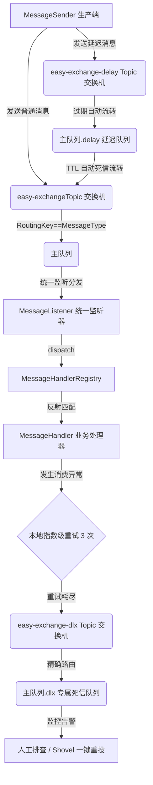

# 🚀 Easy-Rabbit-MQ-Starter

[](http://www.apache.org/licenses/LICENSE-2.0.txt)
[](https://central.sonatype.com/artifact/io.github.hsh945/easy-rabbit-mq-starter)
[](https://www.oracle.com/java/technologies/downloads/)
[](https://spring.io/projects/spring-boot)

**Easy-Rabbit-MQ-Starter** 是一款专为 Spring Boot 3 + Java 17 + 架构设计的、轻量级且生产级的高可靠 RabbitMQ 快速装配组件。

它旨在彻底消除原生 Spring AMQP 繁琐的配置模版（Queue、Exchange、Binding），提供开箱即用的**指数退避重试**、**专属死信兜底**与**延迟消息流转**的高可用核心能力。

---

## 🌟 核心特性

*   **⚡ 声明式零代码装配**：只需几行 YAML 配置，启动时自动声明交换机、主队列、延迟队列及相应的死信绑定，无需手写任何 Bean。
*   **🎯 统一消费分发（MessageHandler 模式）**：告别零散的 `@RabbitListener`！采用注册中心策略模式分发，支持业务数据实体 Jackson 自动反序列化。
*   **🛡️ 闭环容错机制**：内置 **自动重试 $\rightarrow$ 指数级退避 $\rightarrow$ 专属死信队列（DLQ）** 最安全的生产实践兜底流程，确保消息零丢失。
*   **⏳ 完美的延时队列支持**：基于 RabbitMQ 队列 TTL 与死信路由巧妙实现，开箱即用，满足各种延时提醒、超时未支付取消等业务场景。
*   **🧩 零侵入轻量设计**：基于 Spring Boot 3 最新 SPI 自动装配导入（`AutoConfiguration.imports`），不污染主系统包扫描。

---

## 📐 消息流转架构



---

## 🚀 快速开始

### 1. 引入依赖

#### Maven
```xml
<dependency>
    <groupId>io.github.hsh945</groupId>
    <artifactId>easy-rabbit-mq-starter</artifactId>
    <version>1.0.2</version>
</dependency>
```

### 2. 添加 YAML 配置

在微服务的 `application.yml` 中添加配置。支持多微服务模块共用同一 MQ 但拥有各自独占的队列：

```yaml
spring:
  rabbitmq:
    host: 127.0.0.1 # 修改为你的 url
    port: 5672
    username: guest # 修改为你的账号
    password: guest # 修改为你的密码
    # --- Easy MQ 核心配置 ---
    easy-mq:
      enabled: true                     # 缺省值改为 true 了，引入依赖则视为启用，false 可关闭
      queue: order-service-queue        # 当前子系统独有的消费队列名 (只生产不消费的模块可不配)
      # exchange: easy-exchange           # 默认业务交换机 (默认: easy-exchange)
      # delayExchange: easy-exchange-delay # 默认延时交换机 (默认: easy-exchange-delay)
      # dlxExchange: easy-exchange-dlx     # 默认死信交换机 (默认: easy-exchange-dlx)
    # --- 统一开启 Spring AMQP 自动 Ack 与本地重试 (高可用最佳实践) ---
    listener:
      simple:
        acknowledge-mode: auto
        retry:
          enabled: true
          max-attempts: 3 # 总共尝试 3 次（1 次原始执行 + 2 次重试）
          initial-interval: 2000ms # 第一次重试前等待 2 秒
          multiplier: 2 # 重试间隔倍数（2秒 → 4秒 → 8秒 → 16秒，这样一直翻倍）

        # 当前上面这个配置现象是 一共执行 3 次（1 次原始执行 + 2 次重试）
        # 第 1 次消费失败 → 等待 2 秒 后重试
        # 第 2 次失败 → 等待 4 秒 后重试
        # 第 3 次失败 → 进入死信队列或记录失败日志
```

---

## 💻 业务核心使用示例

### 1. 定义消息 DTO

```java
public class TestCreateOrderMessage implements Serializable {
    private Long userId;
    // getter, setter, constructor...
}
```

### 2. 编写消费者（实现 `MessageHandler` 接口）

只需要实现 `MessageHandler<T>` 接口，你的类被 Spring 托管（如加上 `@Component`）后，Starter 将在启动时**自动建立绑定关系并路由**：

```java
import io.github.hsh945.rabbitmq.MessageHandler;
import org.springframework.stereotype.Component;

@Component
public class CreateOrderHandler implements MessageHandler<TestCreateOrderMessage> {

    @Override
    public String getMessageType() {
        // 这将作为 RabbitMQ 中的 RoutingKey
        return "CREATE_ORDER";
    }

    @Override
    public Class<TestCreateOrderMessage> getMessageClass() {
        return TestCreateOrderMessage.class;
    }

    @Override
    public void handle(TestCreateOrderMessage message) {
        System.out.println("收到延时消息创建订单，UserId: " + message.getUserId());
        // 你的核心业务处理逻辑...
        
        // 💡 如果在此处抛出异常，系统将自动重试 3 次后自动打入 order-service-queue.dlx 专属死信队列！
    }
}
```

### 3. 发送普通/延时消息

直接在你的业务代码中注入 `MessageSender` 并调用：

```java
import io.github.hsh945.rabbitmq.MessageSender;
import org.springframework.beans.factory.annotation.Autowired;
import org.springframework.stereotype.Service;

@Service
public class OrderService {

    @Autowired
    private MessageSender messageSender;

    public void createOrder() {
        TestCreateOrderMessage message = new TestCreateOrderMessage(1L);

        // 1. 发送普通即时消息
        messageSender.sendDirectMessage("CREATE_ORDER", message);

        // 2. 发送延迟消息 (例如：10 秒后到期触发)
        messageSender.sendDelayMessage("CREATE_ORDER", message, 10);
    }
}
```

---

## 🛠️ 生产环境死信管理最佳实践

当消息消费失败重试耗尽并进入 `order-service-queue.dlx` 专属死信队列后，推荐如下的处理流程：

1.  **报警与监控**：通过 Prometheus 监控死信队列的消息积压量，一旦 `order-service-queue.dlx` 的消息数 $>0$，立刻报警给核心开发。
2.  **人工排错**：开发排查日志，修复 Bug 并完成发布。
3.  **数据重投**：
    *   在 RabbitMQ 管理后台启用官方的 `rabbitmq_shovel` 插件。
    *   在 `Admin` -> `Shovel Management` 新增一个 Shovel，将 `order-service-queue.dlx`（源队列）安全地搬运回 `order-service-queue`（目的队列）重新消费，实现生产零故障、零丢单。

---

## 📄 开源许可证

本项目基于 [Apache License 2.0](LICENSE) 许可证开源。
